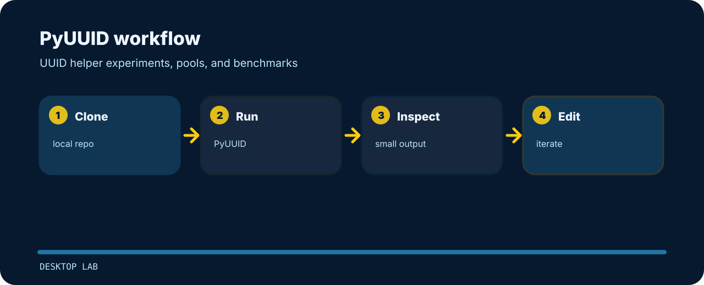

# PyUUID

| Detail | Value |
| --- | --- |
| Area | desktop lab |
| Entry | `PyUUID` |
| Input | small local input |
| Output | readable terminal output |


UUID helper experiments, pools, and benchmarks.

## Run it locally

```bash
git clone https://github.com/mertefekurt/PyUUID.git
cd PyUUID
PyUUID
```

## Working map



## Useful edges

A few choices worth keeping in mind:

- Designed as a focused desktop lab repo.
- Keeps setup short.
- Prioritizes readable output over infrastructure.
