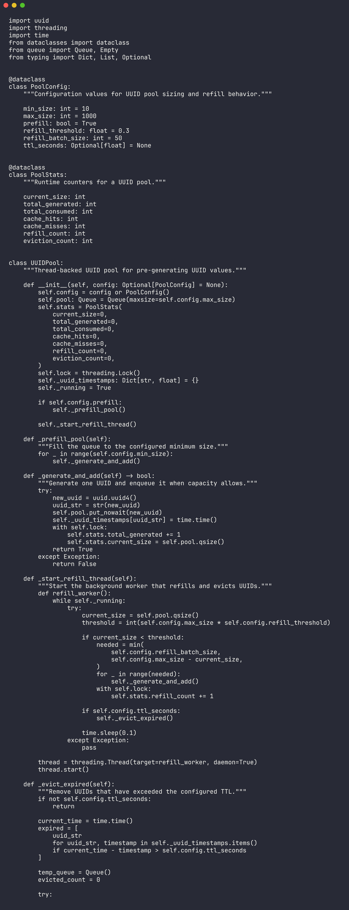

# PyUUID

<div align="center">


</div>

PyUUID is a small toolkit for generating, validating, pooling, benchmarking, migrating, and analyzing UUID values in Python. It is useful as a learning project and as a reference for common identifier workflows.



## Features

- UUID validation and parsing helpers
- Short IDs, session tokens, API keys, and transaction IDs
- Deterministic namespace UUID generation
- Thread-backed UUID pool with refill and TTL behavior
- Benchmark suite for UUID versions and conversions
- Migration and analysis utilities

## Quick Start

```bash
git clone https://github.com/mertefekurt/PyUUID.git
cd PyUUID
python uuid_utils.py
python uuid_benchmark.py
```

Use the helper functions:

```python
from uuid_utils import generate_short_id, is_valid_uuid

short_id = generate_short_id(12)
print(short_id)
print(is_valid_uuid("550e8400-e29b-41d4-a716-446655440000"))
```

## File Map

| File | Purpose |
| --- | --- |
| `uuid_utils.py` | Generation, validation, parsing, and namespace helpers |
| `uuid_pool.py` | Pre-generated UUID pool with runtime statistics |
| `uuid_benchmark.py` | Timing benchmarks and CSV-style summaries |
| `uuid_migration.py` | Migration support for existing identifiers |
| `uuid_analysis.py` | UUID analysis and inspection helpers |

## Notes

Use UUIDv4 for general random identifiers and namespace UUIDs when the same input should always produce the same output. Review collision, privacy, and persistence requirements before choosing an identifier strategy.
